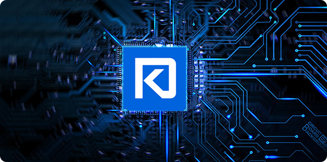

# What is DakarCoin?

DakarCoin is an experimental digital currency that enables instant payments to
anyone, anywhere in the world.

The total amount of network original token DAK issued is 6.88 million, the total amount of mining and destruction is 6.8 million, and the total amount of circulation in the whole network is 80000.

DakarCoin uses peer-to-peer technology to operate
with no central authority: managing transactions and issuing money are carried
out collectively by the network. DakarCoin Core is the name of open source
software which enables the use of this currency.


# Documentation

For comprehensive documentation, see developer.Dakarwallet.com.

# Building

For build instructions, see developer.Dakarwallet.com/wallet-core/building


# Using from your project

If you want to use wallet core in your project follow these instructions.

## Android

Future Android releases will be hosted on [GitHub packages](https://github.com/Dakarwallet/wallet-core/packages/700258), please checkout [this guide](https://docs.github.com/en/packages/guides/configuring-gradle-for-use-with-github-packages#installing-a-package) for more details.

Add this dependency to build.gradle and run `gradle install`

```groovy
plugins {
    id 'maven'
}

dependencies {
    implementation 'com.Dakarwallet:wallet-core:x.y.z'
}
```


# Contributing

The best way to submit feedback and report bugs is to [open a GitHub issue](https://github.com/Dakarwallet/wallet-core/issues/new).
If you want to contribute code please see [Contributing](https://developer.Dakarwallet.com/wallet-core/contributing).
If you want to add support for a new blockchain also see [Adding Support for a New Blockchain](https://developer.Dakarwallet.com/wallet-core/newblockchain), make sure you have read the [requirements](https://developer.Dakarwallet.com/wallet-core/newblockchain#requirements) section.

Thanks to all the people who contribute.
<a href="https://github.com/Dakarwallet/wallet-core/graphs/contributors"></a>

# License

Dakar Wallet Core is available under the MIT license. See the [LICENSE](LICENSE) file for more info.

Testing
-------

Testing and code review is the bottleneck for development; we get more pull
requests than we can review and test on short notice. Please be patient and help out by testing
other people's pull requests, and remember this is a security-critical project where any mistake might cost people
lots of money.

# Automated Testing

Developers are strongly encouraged to write [unit tests](src/test/README.md) for new code, and to
submit new unit tests for old code. Unit tests can be compiled and run
(assuming they weren't disabled in configure) with: `make check`. Further details on running
and extending unit tests can be found in [/src/test/README.md](/src/test/README.md).

There are also [regression and integration tests](/test), written
in Python, that are run automatically on the build server.
These tests can be run (if the [test dependencies](/test) are installed) with: `test/functional/test_runner.py`

The Travis CI system makes sure that every pull request is built for Windows, Linux, and macOS, and that unit/sanity tests are run automatically.

# Manual Quality Assurance (QA) Testing

Changes should be tested by somebody other than the developer who wrote the
code. This is especially important for large or high-risk changes. It is useful
to add a test plan to the pull request description if testing the changes is
not straightforward.
